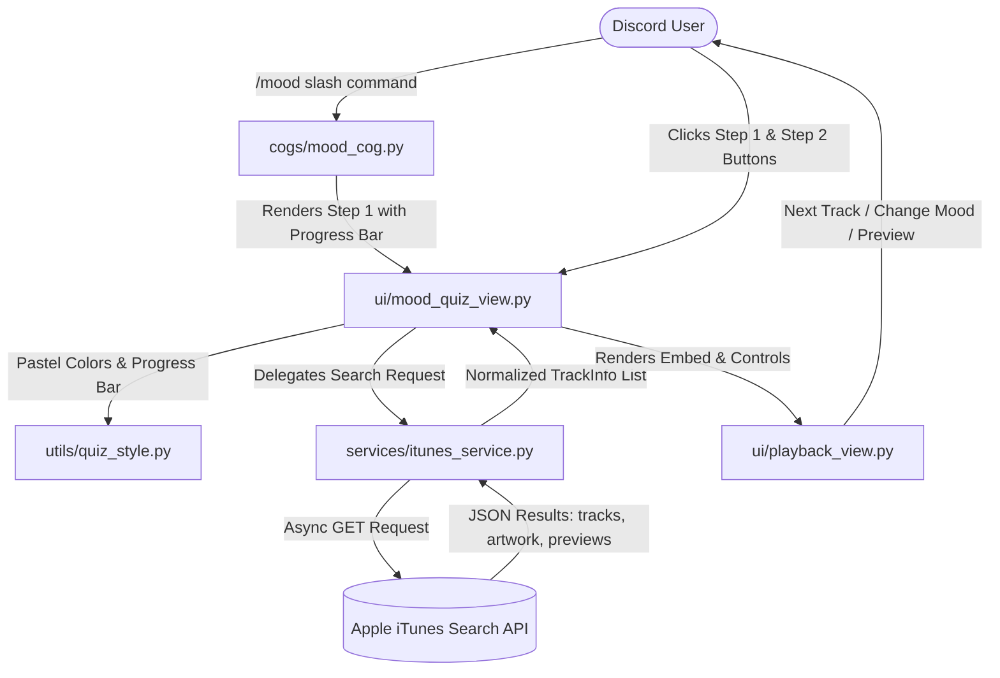

# AuraTunes: Mood-Based Music Recommendation Discord Bot

A modular, production-ready Discord bot built with Python (`discord.py` v2) that recommends music tailored to a user's current mood. It features an interactive button-based questionnaire with visual progress bars, graceful iTunes Search API integration (100% free with no authentication required), interactive playback controls, and clean academic-grade documentation.

---

## 🌟 Key Features

1. **Interactive Button-Based MCQ (`/mood`)**:
   - Infer emotional state and musical preference using modern Discord UI buttons (`discord.ui.View`) instead of cumbersome text inputs.
   - Live visual progress bar (e.g. `[▰▰▰▰▰▱▱▱▱▱] Step 1 of 2 (50%)`) updating in-place on the same message.
   - User-locked interactions: prevents other server members from clicking or hijacking another user's quiz.

2. **Zero-Cost & Free-Tier Friendly (iTunes Search API)**:
   - Queries `https://itunes.apple.com/search` directly.
   - **No API keys, no registration, no billing, and no credit card required**.
   - Automatic 30-second high-quality audio preview stream and 600x600 high-resolution album artwork.

3. **Shared Styling System (`quiz_style.py`)**:
   - Rotating pastel palette for aesthetic, soft visual themes that render beautifully in both Discord dark and light modes.
   - Standardized embed builder enforcing consistent timestamps, footers, and metadata across all commands.

4. **Interactive Playback Controls**:
   - **⏭️ Next Track (Skip)**: Cycles smoothly through candidate tracks fetched from the mood query.
   - **🎧 Audio Preview**: Direct external link button to listen to the 30-second AAC snippet.
   - **🔄 Change Mood**: One-click restart button to re-trigger the MCQ directly from the recommendation embed.
   - **🔗 Apple Music**: Direct link to the complete track on Apple Music.

5. **Robust Error Handling**:
   - Catches timeouts, network failures, and zero-match responses.
   - Returns clear, friendly error embeds with constructive suggestions (e.g. suggesting alternative mood combinations) rather than failing silently.

---

## 🏗️ System Architecture



---

## 📁 Project Directory Structure

```
discord-bot/
├── .env.example              # Template for bot token and configuration
├── .gitignore                # Prevents committing secrets or cache files
├── requirements.txt          # Python package dependencies
├── config.py                 # Centralized configuration and token validator
├── bot.py                    # Discord bot client, setup_hook, cog loader
├── utils/
│   ├── __init__.py
│   └── quiz_style.py         # Shared pastel palette, progress bar, embed factory
├── services/
│   ├── __init__.py
│   └── itunes_service.py     # Asynchronous iTunes Search API client & error handling
├── ui/
│   ├── __init__.py
│   ├── mood_quiz_view.py     # 2-step button MCQ finite state machine
│   └── playback_view.py      # Interactive playback controls (skip, preview, restart)
├── cogs/
│   ├── __init__.py
│   ├── mood_cog.py           # /mood and /moods commands
│   └── music_cog.py          # /recommend (direct) and /search commands
└── tests/
    ├── __init__.py
    ├── test_quiz_style.py    # Unit tests for progress bar & pastel palette
    └── test_itunes_service.py# Unit tests for data models, duration & mood mapping
```

---

## 🚀 Step-by-Step Setup Guide

### 1. Create Bot Application on Discord Developer Portal

1. Navigate to the [Discord Developer Portal](https://discord.com/developers/applications).
2. Click **New Application** in the upper-right corner.
3. Enter an application name (e.g. `AuraTunes`) and accept the Developer Terms of Service.
4. Go to the **Bot** tab on the left sidebar:
   - Click **Reset Token** (or **Add Bot** if prompted) and copy your **Bot Token**.
   - Keep this token secret! Never commit it to version control.
5. Under **Privileged Gateway Intents**:
   - AuraTunes uses modern Discord Slash Commands (`/command`) and Button Webhooks, meaning **no privileged intents are required**! (You can leave *Presence Intent*, *Server Members Intent*, and *Message Content Intent* unchecked).

### 2. Generate the Bot Invite Link

1. On the Developer Portal, click **OAuth2** ➔ **URL Generator** on the left menu.
2. Under **Scopes**, check:
   - `bot`
   - `applications.commands` (enables slash commands)
3. Under **Bot Permissions**, select:
   - `Send Messages`
   - `Embed Links`
   - `Attach Files`
   - `Use External Emojis`
   - `Read Message History`
4. Copy the generated URL at the bottom of the page, paste it into your web browser, and invite the bot to your Discord test server.

### 3. Configure Local Environment

1. In the `discord-bot` project root directory, copy `.env.example` to `.env`:
   ```bash
   cp .env.example .env
   ```
2. Open `.env` in any editor and insert your bot token:
   ```env
   DISCORD_TOKEN=your_copied_bot_token_here
   # (Optional) Add your server's Guild ID for instant slash command synchronization:
   GUILD_ID=
   ```
   > **Tip**: Enabling Developer Mode in Discord allows you to right-click your server icon and select **Copy Server ID** to get your `GUILD_ID`. This makes slash commands appear instantly during development instead of waiting up to an hour for Discord's global sync.

### 4. Install Dependencies & Run

Create a virtual environment and install the required packages:

```bash
# Create and activate virtual environment
python3 -m venv venv
source venv/bin/activate

# Install requirements
pip install -r requirements.txt

# Run unit tests to verify installation
python3 -m unittest discover -s tests -p "test_*.py"

# Start the bot
python3 bot.py
```

When started, the terminal will log:
```
[INFO] AuraTunes: AuraTunes v1.0.0 is ONLINE!
[INFO] AuraTunes: Logged in as: AuraTunes#1234
[INFO] AuraTunes: Synced 4 slash commands globally
```

---

## 🎮 Available Commands

| Command | Type | Description |
| :--- | :--- | :--- |
| `/mood` | Slash Command | Starts the interactive 2-step button MCQ to infer mood and recommend music. |
| `/moods` | Slash Command | Displays an educational catalog of supported mood archetypes and musical heuristics. |
| `/recommend <mood> [genre]` | Slash Command | Directly fetches music recommendations without taking the quiz. |
| `/search <query>` | Slash Command | Direct search on iTunes for any artist or song title. |

---

## 🎓 Academic Defense & Technical Explanation Guide

When presenting or submitting this project, here are the key technical concepts and rationale to explain:

### 1. Why `discord.py` Cogs Architecture?
- **Separation of Concerns (SoC)**: Instead of a monolithic `bot.py` script, commands and listeners are organized into self-contained modules (`MoodCog`, `MusicCog`).
- **Open/Closed Principle (OCP)**: New features or commands can be introduced simply by dropping a new file into `cogs/` without altering core bot initialization.

### 2. Why Button-Based UI (`discord.ui.View`) over Text Input?
- **Eliminates Input Parsing Errors**: Free-text user prompts often suffer from typos, slang, or unsupported inputs. Button MCQs constrain choices to valid options while delivering a frictionless, interactive user experience.
- **State Preservation**: The `MoodQuizView` acts as a Finite State Machine (FSM). It holds the intermediate state (`selected_mood`, `current_step`) in memory and updates the message in-place, eliminating channel notification spam.

### 3. Why Asynchronous I/O (`aiohttp`) over `requests`?
- Python's `requests` library is synchronous and **blocking**. If a network call to an external API takes 2 seconds, a synchronous call would freeze the entire Discord bot, dropping heartbeat pings and causing disconnects.
- `aiohttp` cooperates with `asyncio`, releasing the event loop while awaiting the network response so the bot remains completely responsive to other users and servers.

### 4. Why the iTunes Search API?
- **Accessibility & Zero Barrier to Entry**: Major streaming APIs (Spotify, YouTube) require developer accounts, OAuth2 tokens, and often credit cards. Apple's iTunes Search API is completely free, public, and provides metadata, high-res artwork, and 30-second audio previews out of the box.

### 5. Graceful Error Handling Design
- Instead of raw stack traces or silent failures, the service uses custom domain exceptions (`MusicServiceException`, `NoTracksFoundError`, `MusicAPIError`).
- In case of network drops or obscure queries, the user is presented with a non-intrusive warning embed explaining the situation and offering a one-click `[🔄 Try Different Mood]` retry button.
